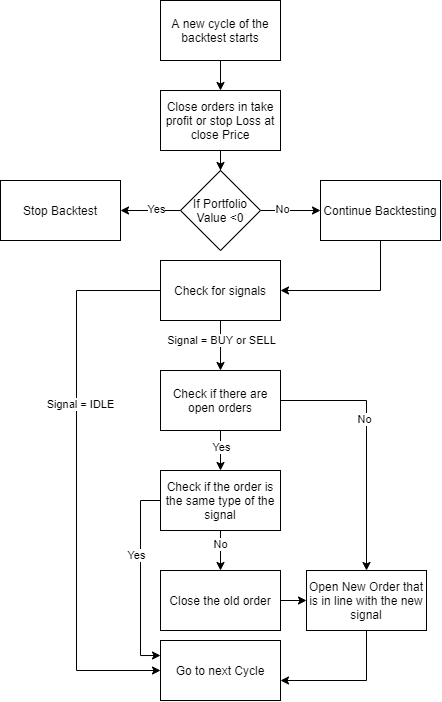

```{r setup, include=FALSE}
knitr::opts_chunk$set(echo = TRUE)
```

# Objective
The objective of the project is to create a simple **backtester** that is able to test the performance of trading systems, given as an input a `CSV` downloaded from [Investing USA](https://www.investing.com/).


## The project, in Practice 
In this project, a simple backtesting engine has been created and a simple strategy based on [Relative Strength Indicator](https://www.investopedia.com/terms/r/rsi.asp) has been used as a practical example to show the effectiveness of the backtester.

Regarding the RSI Strategy, it relies on simple Technical Analysis and on the concept of over-sold and over-bought: the strategy will stay in `IDLE` when the indicator is between the upper and the lower boundaries, while it will recommend to `BUY` or `SELL` when it will be respectively below the lower level and  above the upper one.

## Notes on the Project
1. It's written in vanilla R language, external packages has not been used as I aimed to code everything from scratch instead of using pre-built functions
2. I have made extensive use of Object Oriented Programming in R Language (i.e. `Indicators`, `Portfolio` and `Strategies` are Objects, while `Orders` are rows in a `data.frame` due to motivations that will be explained in the following sections)

# Architecture Description
The Architectural design behind this project is based on Object Oriented Programming, therefore, as already said, some components of the project are Objects created by their respective Classes.

The main reason behind this choice is the need for entities from which I could be able to call attributes (variables associated to the entity) and methods.
For instance, regarding the portfolio, I wanted to have an entity that represented the portfolio itself and from which I could have the value of it, but also functions such as `addOrder` or `closeOrder`.

Object Oriented Programming is substantiated by the creation of classes, which in are are declared using the function `setRefClass()` which creates an S4 class (an updated and more complete version of the S3 classes as it provides the possibility to create custom functions and use the object itself inside the function).

Thanks to the simple reproducibility of objects due to classes (in fact, they can be considered as blueprints of objects), I have decided to adopt this data type also for `Indicators` and `Strategies` for scalability reasons and for the motivations already stated.

## Note on architectural decision on Order Entity

The `Order` Entity, which represents a buy or sell order, is not an object although it would be eligible.
The motivation is that in R Language, Objects can be stored in vectors, but they instantly lose their parameters and methods as shown below.
```{r}
gen <- setRefClass("myRefClass", 
                   fields=list(aa="character"),
                   methods=list(
                     hi= function(){
                       cat("hi")
                     }
                   )
)
x <- gen$new(aa="nome")
y <- gen$new(aa="bana")
a<-c(x,y)

b<-a[1]
b$aa # NULL
#b$hi() throws an error
a[1]$aa # NULL
```

Nonetheless, the main idea was to store all the orders inside a vector of the portfolio.
In order to work around the problem, it has been treated as a simple row in a data.frame.


# How to Start the Project

The project is already set up and it's possible to run it without any change: run the `init.R` code line by line or as a whole.

If, instead, it is needed to change the input parameters, it is mandatory to:

1. download historical data from [Investing USA](https://www.investing.com/) in CSV, such as [Apple Stock](https://www.investing.com/equities/apple-computer-inc-historical-data)
2. change in the file `init.R` the input parameters 
  a.`pathOfFinancialData`, which is the path of the `.CSV`. Note: you can use both relative and absolute path. 
  b. `initialPortfolioValue`, which is the amount of money in the portfolio at the beginning of the simulation.
  c. `percentageOfPortfolioForEachInvestment`, which is the percentage of the portfolio which is invested in each trade.
  d. `indicatorsParameters`: the parameters chosen for the strategy, that are in this case respectively: the periods of the RSI, the lower bound and the upper 60
 
An example is provided below:

```{r eval=FALSE}
path = ".\\inputCSVData\\S&P 500 Historical Data Reversed with missing data.csv"
# or using absolute path
# path = "C:\\Users\\Michelangelo\\Desktop\\Projects\\BacktesteR-MVP\\inputCSVData\\S&P 500 Historical Data Reversed with missing data.csv"
initialPortfolioValue = 10000
percentageOfPortfolioForEachInvestment=0.1

indicatorsParameters= c(8, 40, 60)
```

After having the parameters set, start the code in `init.R` line-by-line or as a whole.

## Errors in starting the code

If you are trying to run the code of `init.R` and R throws errors while reading the `source("file.r")` such as:
```{r eval=FALSE}
 source("dataInputFunctions.R")
Error in file(filename, "r", encoding = encoding) : 
  non posso aprire questa connessione
Inoltre: Warning message:
In file(filename, "r", encoding = encoding) :
  cannot open file 'dataInputFunctions.R': No such file or directory
```
then try to set the working directory as the one of the project with `setwd(folder)` manually, such as:
```{r eval=FALSE}
setwd("C:\\Users\\Michelangelo\\Desktop\\Projects\\BacktesteR-MVP")
```
# Backtester Description

In this section, it will be shown how the code works under the hood and will be explained the logical steps of the backtester starting from the first line of `init.R`.

## Initial Setup

A new RSI Strategy Object is created from the `singleRSIStrategy` Class after setting the environment and the input paramenters.

It is important to not that the English language using `Sys.setlocale(locale = "English")` in order to parse the dates present inside the CSV.

```{r Starting environment, Setting Input Parameters and Strategy, message=FALSE, warning=FALSE}
rm(list=ls())
graphics.off()
Sys.setlocale(locale = "English")
setwd(dirname(rstudioapi::getSourceEditorContext()$path))
# Input options
pathOfFinancialData = ".\\inputCSVData\\S&P 500 Historical Data Reversed with missing data.csv"
initialPortfolioValue = 10000
percentageOfPortfolioForEachInvestment=0.1
indicatorsParameters= c(8, 40, 60)

# Add paths
source("dataInputFunctions.R")
source("portfolioModel.R")
source("strategies/singleRSIStrategyModel.R")
source("strategies/bollingerBandsStrategyModel.R")
source("orderFunctions.R")
source("backtest.R")
source("analytics.R")
source("./indicators/RSIModel.R")
source("./indicators/BollingerBandsModel.R")

strategy = singleRSIStrategy$new(); 
```

Then, the process of data retrieving and cleaning starts:
1. The CSV parsed and stored into a `data.frame`
2. The data is then cleaned from missing values( if in the row is present a `NA` value, the row is removed) and is sorted by date
3. Finally, the data is indexed

```{r Reading and Cleaning Data}
rawData = readDataFromCSV(pathOfFinancialData)
dataOutput = cleanAndValidateData(rawData)
cleanData = dataOutput$data
missingValues = dataOutput$missingValues
missingValues
```

Moreover, the Portfolio is created with its initial values; valueHistory is a `data.frame` where the chages of the portfolio value are stored.

```{r Creating Portfolio}
portfolio = portfolioClassGenerator$new(
  value=initialPortfolioValue, 
  orders = data.frame(),
  valueHistory = data.frame(
    Date=c(cleanData$Date[1]),
    Value=c(initialPortfolioValue),
    Change=c(NA)
    )
  );
```

The last step before starting the backtest consists in adding the parameters of the RSI to the strategy, in fact, the objective of the function `addIndicators(values)` is to create a RSI object (with input parameters the ones that has been chosen before) as a variable inside the strategy and use it to produce signals.

```{r Adding the RSI Indicator to Strategy}
strategy$addIndicators(indicatorsParameters)
```

## Backtest
The backtest starts and the portfolio is returned.
In this phase, orders and signals are computed as it will be explained in the following sections.
```{r Backtest}
portfolio = backtestStrategy(portfolio, strategy, cleanData)
```

## Output and Analytics

In this section, a series of output, metrics and analytics is provided

Plot of price and returns of the timeseries analyzed:

```{r echo=FALSE}
plot(cleanData$Date, cleanData$Price, type="l", xlab="Date", ylab="Prices", main="Timeseries Prices")
plot(cleanData$Date, cleanData$Change, type="h", xlab="Date", ylab="Returns", main="Timeseries Returns")
abline(h=0, col="blue")
```

RSI Indicator:

```{r echo=FALSE}
strategy$plotIndicators(cleanData)
```

Portfolio value at the end of the backtest, interest and standard deviation:

```{r}
portfolio$value
interest = (portfolio$value/initialPortfolioValue-1)
interest
standardDeviation = sd(portfolio$valueHistory$Value)
standardDeviation
```

Changes in portfolio value:

```{r}
portfolio$valueHistory
```

Equity Line:

```{r echo=FALSE}
plot(portfolio$valueHistory$Date,portfolio$valueHistory$Value, type="l", xlab="Date", ylab="Value", main="Equity Line")
abline(h=initialPortfolioValue, col="red")
```

Drawdown:

```{r echo=FALSE}
plotDrawdown(portfolio$valueHistory, initialPortfolioValue)
```

Rolling sharpe Ratio:

```{r echo=FALSE}
plotRollingSharpe(portfolio$valueHistory,cleanData, initialPortfolioValue)
```

calculated in a simpler way by assuming the risk free rate equals to 0

$$
RollingSharpe_t = \frac{Interest_t}{\sigma_t}
$$

Portfolio Orders:

```{r}
portfolio$orders$openDate = as.Date(portfolio$orders$openDate, origin="1970-01-01")
portfolio$orders$closeDate= as.Date(portfolio$orders$closeDate, origin="1970-01-01")
portfolio$orders
```

Amount of Orders:

```{r}
amountOfOrders = nrow(portfolio$orders)
amountOfOrders
```
Amount Of Buy Orders Percentage:
```{r}
amountOfBuyOrdersPercentage = sum(portfolio$orders$type=="BUY")/amountOfOrders
amountOfBuyOrdersPercentage
```
Amount Of Sell Orders Percentage:
```{r}
amountOfSellOrdersPercetage = sum(portfolio$orders$type=="SELL")/amountOfOrders
amountOfSellOrdersPercetage
```
Missing Values in Data
```{r}
missingValues
```

The output in CSV are skipped.

## Code Explainations

### A note on Strategy Entity and RSI Entity
It is important to understand the structure and the usefulness of the Strategy entity.
This entity has the purpose, as in normal Trading systems, of checking for signals and inform about the amount of data(starting the count from the day before the day considered) needed by the indicator to compute those signals.
In fact, RSI indicator, as well as most of all Technical indicators, need a certain amount of data to create a meaningful result and not errors(for instance, an indicator that expects 14 parameters, if provided with just 6, would throw an error or an unfaithful result).


$$
RSI Value = 100-\frac{100}{1+\frac{Average Gain}{Average Loss}}
$$
Regarding RSI Entity, it's important,when computing its formula, to take into account the event by which negative or positive returns are not available for the data (maybe due to a strong uptrend or downtrend).
In order to deal with this problem, the value 0 will be assigned to the potential void variable.
```{r eval=FALSE}
#[...Code...]
if (sum(returns>=0)==0) {
upReturns = 0
}
else{
  upReturns = returns[returns>=0]
}
if (sum(returns<0)==0){
 downReturns = 0
}
else{
  downReturns = returns[returns<0];
}
#[...Code...]
```

### Backtester Logic

The logic of the backtester is shown in the chart above.
It is, on a basic level, a FOR cycle that runs from the `startingPoint` of the strategy.
The `backtestStrategy(portfolio, strategy, financialData)` function is shown below.
```{r eval=FALSE}
startingValue = strategy$startingPoint()+1
  amountOfDataFromToday = strategy$amountOfDataFromToday()
  portfolio$strategy = strategy

  for (dateIndex in startingValue:nrow(financialData)) {
    dataInputForStrategy = financialData[(dateIndex-amountOfDataFromToday):dateIndex-1,]
    todayPrice = financialData$Price[dateIndex]
    todayDate = financialData$Date[dateIndex]
```

The backster then will check for orders to close and check whether the portfolio has still some money inside and if not, it will stop. If it is the last day of the trading strategy, the OPEN orders will be closed and the code will stop:
```{r eval=FALSE}
    portfolio$checkForOrdersToClose(todayPrice, todayDate)
    amountInPortfolio = portfolio$value

    if (amountInPortfolio <=0){
      break
    }
    else if (dateIndex == length(financialData$Date)){
     portfolio$closeAllOrders(todayPrice, todayDate)
    }
```

Moreover, if it is not the last day of trading and the portfolio has still a positive value, the Backtester will check for signals. If the signal is IDLE, which means that the strategy suggests to not trade, the backtester will move to the next trading day.
On the contrary, if there is a BUY or SELL order, the Backtester will check whether there are open orders.
If there are not open orders, it will create an order and add it to the orders of the portfolio.
If the strategy gives a signal that is the same of the open order, then the position will be kept in hold (for instance, the strategy tells to BUY and there is a BUY open order).

```{r eval=FALSE}
 else {
      #'[1) check what strategy says (buy/sell)]
      orderType = strategy$checkForSignals(dataInputForStrategy)
      
      if (orderType=="IDLE"){
        next
      }

      #'[2) check if there are orders open]
      orderResult = portfolio$checkForOpenOrders(orderType)
      ordersOpen = orderResult$ordersOpen
      orderIndex = orderResult$orderIndex
      #'[3) if no order is open, open the order]
      if (length(ordersOpen)==0){
        orderPlaced = createOrder(
          openPrice=todayPrice, 
          openDate=todayDate, 
          type=orderType
          )
        portfolio$addOrder(orderPlaced)
      }
    #'[4) check if the order is the same of the signal]
      else if (isOrderOfThisType(ordersOpen, orderType)){ # if true
    #'[5) hold the order - DO NOTHING]   
      } 
```
Lastly, if the order has a type contrary to the one suggested by the signals, the order will be closed and a new order coherent with the signal will be opened
```{r eval=FALSE}
     else if (!isOrderOfThisType(ordersOpen, orderType)){
      #'[7) close the opposite order]
      portfolio = portfolio$closeOrder(orderIndex,todayPrice, todayDate)
      #'[8) open new order]
      orderPlaced = createOrder(
        openPrice=todayPrice, 
        openDate=todayDate, 
        type=orderType)
      portfolio$addOrder(orderPlaced)
      }
    }
  }
```


# Scaling with New Strategies and Indicators
The project is made to scale: if there is the need to add new Strategies or Indicators, it will be easy as the above mentioned entities are `Objects of Classes`.

In order to create new indicators, it will be needed to create a class with the following mandatory parameters and methods: `amountOfDataFromToday`

In order to create new Strategies, it will be needed to create a class with the following mandatory parameters and methods:
`addIndicators()`, `checkForSignals()`, `startingPoint()`, `amountOfDataFromToday()`,
`plotIndicators()`

## An Example With Bollinger Bands


A practical example consists in the creation of a new strategy: the classical Bollinger Bands strategy witht the same Historical Data.

```{r echo=FALSE, message=FALSE, warning=FALSE}
strategy = bollingerBandsStrategy$new()
rawData = readDataFromCSV(pathOfFinancialData)
# Creation of the Portfolio
portfolio = portfolioClassGenerator$new(
  value=initialPortfolioValue, 
  orders = data.frame(),
  valueHistory = data.frame(
    Date=c(cleanData$Date[1]),
    Value=c(initialPortfolioValue),
    Change=c(NA)
    )
  )
# backtest
strategy$addIndicators(indicatorsParameters)
# analytics
portfolio = backtestStrategy(portfolio, strategy, cleanData)
```

Plot of price and returns of the timeseries analyzed:

```{r echo=FALSE}
plot(cleanData$Date, cleanData$Price, type="l", xlab="Date", ylab="Prices", main="Timeseries Prices")
plot(cleanData$Date, cleanData$Change, type="l", xlab="Date", ylab="Returns", main="Timeseries Returns")
abline(h=0, col="blue")
```

Bollinger Bands Indicator:

```{r echo=FALSE}
strategy$plotIndicators(cleanData)
```

Portfolio value at the end of the backtest, interest and standard deviation:

```{r}
portfolio$value
interest = (portfolio$value/initialPortfolioValue-1)
interest
standardDeviation = sd(portfolio$valueHistory$Value)
standardDeviation
```

Equity Line:

```{r echo=FALSE}
plot(portfolio$valueHistory$Date,portfolio$valueHistory$Value, type="l", xlab="Date", ylab="Value", main="Equity Line")
abline(h=initialPortfolioValue, col="red")
```

Drawdown:

```{r echo=FALSE}
plotDrawdown(portfolio$valueHistory, initialPortfolioValue)
```

Rolling sharpe Ratio:

```{r echo=FALSE}
plotRollingSharpe(portfolio$valueHistory,cleanData, initialPortfolioValue)
```

